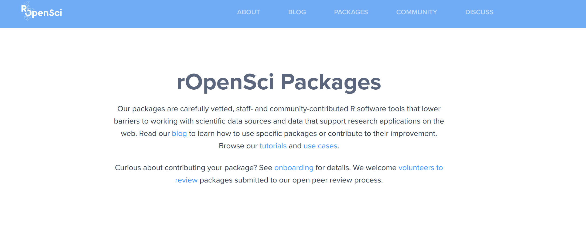

```{r dsetup, results = "hide", echo = FALSE, message = FALSE}
knitr::opts_chunk$set(
  fig.align='center',
  tidy=FALSE,
  comment="R>> ",
  size = 'small'
)
```

## What is `taxize`?

> taxize allows users to search over many taxonomic data sources for species names (scientific and common) and download up and downstream taxonomic hierarchical information

In brief, `taxize` is a R package developed to help you managing taxonomic information.

### Install taxize with

```r
install.packages("taxize") #or
devtools::install_github("ropensci/taxize")
```

Tutorial available at [ROpenSci website](https://ropensci.org/tutorials/taxize_tutorial/)

## Why use `taxize` in a meta-analyses context?

### If your meta-analyses involve working on organisms with several collaborators:

Two situations could easily happen...

**Situation 1 -** Mispelled by collaborators

```r
plants <- c("Poa annua", "Poa anua", " Poa annua")
```

**Situation 2 -** Inconsistent taxonomy within papers: species taxonomy changed over the time...

_Monterey cypress_ has been *Callitropsis macrocarpa*, *Cupressus macrocarpa*, *Cupressus hartwegii*, *Neocupressus macrocarpa*, then back to *Callitropsis macrocarpa*...

## Why to use `taxize`?

Taking advantage of the existant taxonomic backbones...

- Encylopedia of Life
- Taxonomic Name Resolution Service
- Integrated Taxonomic Information Service
- Global Names Resolver
- IUCN Red List                   
- CANADENSYS Vascan name search API
- etc.

**Total:** 21 sources implemented


## Study case 1: Mispelled names

For this case, we use `Global Names Resolver` service:

```{r eval=TRUE, echo=TRUE, }
temp <- taxize::gnr_resolve(names = c("Poa annua", "Poa anua", "  Poa annua"),
                            data_source_ids=c(3))
head(temp)
```

Fuzzy matches could be done with several taxonomy providers:

```{r eval=FALSE, echo=TRUE }
taxize::gnr_datasources()
```

## Study case 2: Inconsistent taxonomic informations

If we go back, to our _Monterey cypress_ example with a fictive scenario:

- Find one publication with *Cupressus macrocarpa* in **1987**
- And another with *Callitropsis macrocarpa* in **1990**

I want to harmonize them with the newest species name for _Monterey cypress_.

## Study case 2: Inconsistent taxonomic informations

I'll use [ITIS](https://www.itis.gov/) to perform this task.

- **First step:** Get the taxonomic serial number (_TSN_) for each species name.
- **Second step:** Check if this these _TSN_ are valid and if not get the valid one with the accepted names.


## Study case 2: Inconsistent taxonomic informations

- **First step:** Get the taxonomic serial number (_TSN_) for each species names.

```{r eval=TRUE, echo=TRUE }
mysps <- c("Callitropsis macrocarpa", "Cupressus macrocarpa")
(tsn <- taxize::get_tsn(mysps, accepted = FALSE, verbose=FALSE))
```

## Study case 2: Inconsistent taxonomic informations

- **Second step:** Check if this these _TSN_ are valid and if not get the valid one with the accepted names.

```{r eval=TRUE, echo=TRUE }
library(taxize)
(accept_tsn <- lapply(tsn, itis_acceptname))
```

## Common name

### Retrieve the english common name from valid scientific name

```{r eval=TRUE, echo=TRUE }
sci2comm('Cupressus macrocarpa', db = 'itis')
```

## Classification

### Retrieve higher taxonomic informations

```{r eval=TRUE, echo=TRUE }
classification(822598, db = 'itis')
```

## Limitations

1. Some species might be absent from databases.
2. Some taxonomic groups are under-represented (e.g. nonvascular plants, some insects family etc.)

## Documentation

### If you want to learn more about the features of this package:

1. [ROpenSci tutorial](https://ropensci.org/tutorials/taxize_tutorial/)
2. [Package Documentation](https://cran.r-project.org/web/packages/taxize/taxize.pdf)

### Have a look at the ROpenSci initiative:

```{r, out.width = "100%", echo=FALSE}

```
